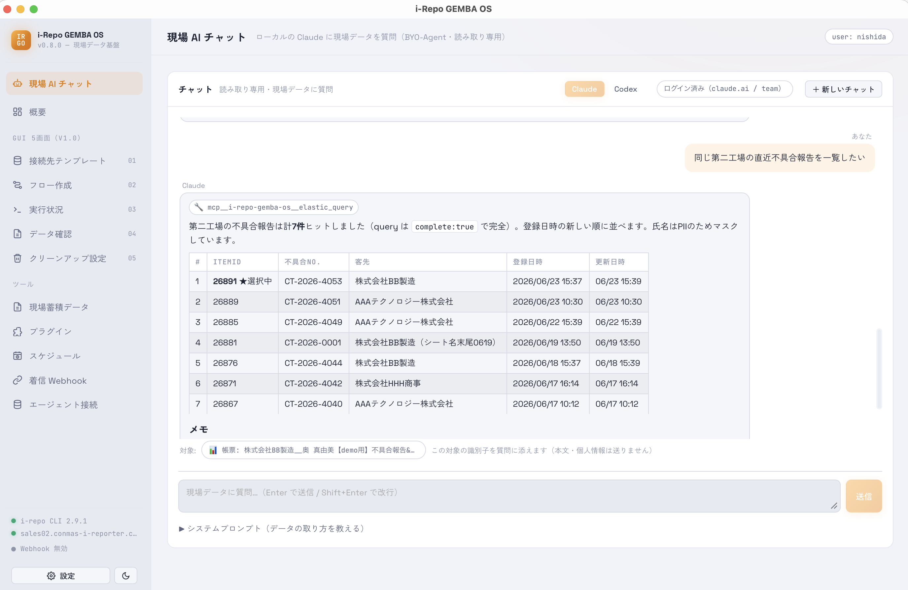

# 現場 AI チャット

アプリの中で、**現場データについて AI に日本語で質問**できる画面です。お使いの Claude をそのまま使うため、推論の料金はお客様のアカウント側に発生します（このアプリが勝手に課金することはありません）。

- 「先月の点検で指摘が多かった項目は？」のように、自然な言葉で聞けます。
- AI は[現場蓄積データ](screen-gemba.html)を**読み取り専用**で参照します。データを書き換えたり消したりはしません。

<figure class="screenshot">
  
</figure>
