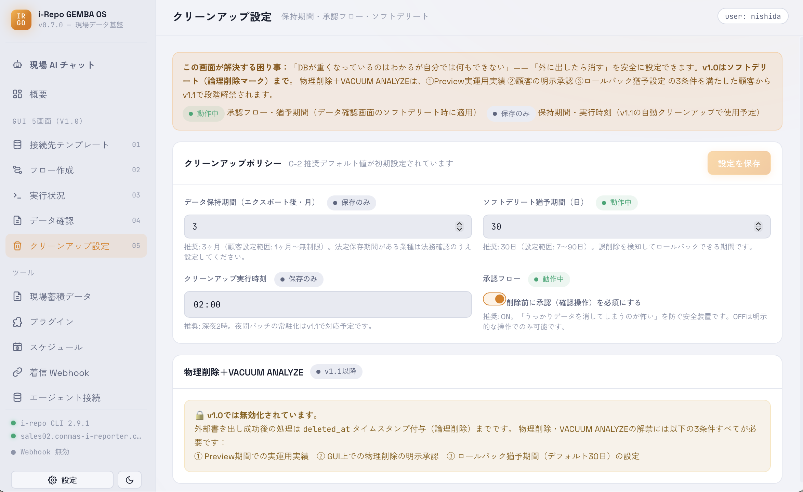

# クリーンアップ設定

送信元のデータを整理する設定です。**保持期間**・**承認フロー**・**ソフトデリート**（すぐ消さず「削除予定」にして後で戻せる方式）を決められます。

> 元データの削除に関わる設定です。**送信先に確実に入ったことを確認してから**整理するのが安全なので、[帳票ライブビュー](screen-reports.html)の後ろに置いています。

<figure class="screenshot">
  
</figure>
