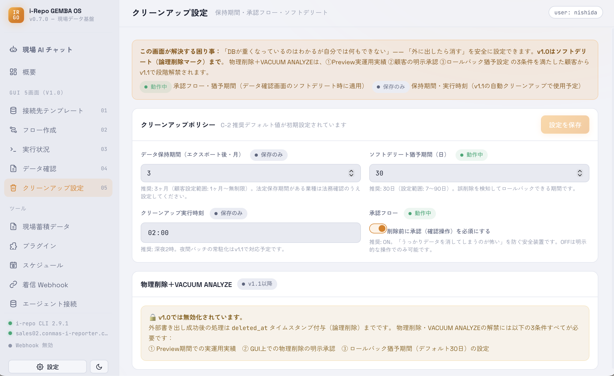

# 削除メンテナンス

i-Reporter サーバ本体の帳票を削除する画面です（論理削除・段階消化の破壊系メンテナンス操作）。
**送信先に確実に配信されたことを確認してから**使うのが安全なので、[帳票ライブビュー](screen-reports.html)の後ろに置いています。

「削除フロー」という単位で削除条件（期間・絞り込み）を決めておき、▶ 即時実行、または毎日・毎週の
スケジュール実行で動かします。

- 削除できるのは、**現在の接続先に配信済み（外部にコピーがある）帳票だけ**です。まだ配信していない
  帳票は外部に控えが無く、削除すると復元できないため対象外になります。
- 削除は**論理削除**です。i-Reporter サーバ側のゴミ箱へ移動する形で、あとから戻せます。
- 誤操作を防ぐため、削除の実行は既定で**無効**です。まず「削除を有効にする」をオンにし、実行前には
  接続先・対象件数・条件を確認ダイアログで確かめてから進みます。
- 大量に削除するときは一度に消さず、少しずつ（段階消化）実行します。1回の実行で削除できる件数には
  上限があり、超えた分は次回の実行に持ち越されます。
- スケジュール実行は、この画面で保存しただけでは動きません。「[スケジュール](screen-scheduler.html)」
  画面で OS のタスクとして登録して初めて、定刻に自動実行されます。
- 実行結果・進捗は「[実行状況](screen-runs.html)」画面で確認できます。

<figure class="screenshot">
  
</figure>
