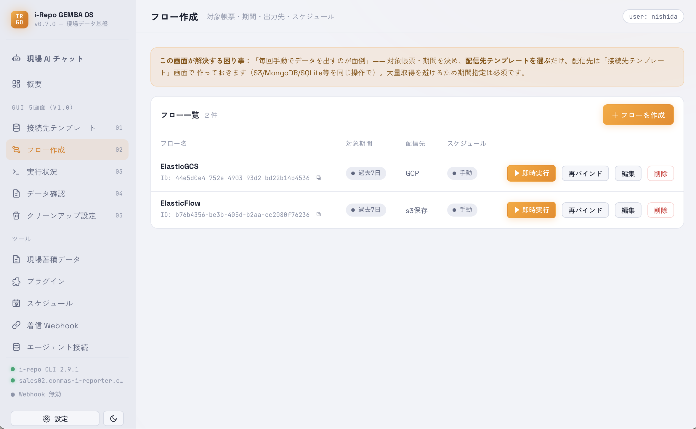

# フロー作成

「**どの帳票を・どの期間・どこへ送るか**」を1セットにまとめたものが **フロー** です。

- 対象の帳票定義・期間・送り先を選びます。
- **今すぐ実行** するほか、**実行条件**（折りたたみを開いて設定） で **毎日／毎週／一定間隔** の定期実行を設定できます。実際の自動実行は [スケジュール](screen-scheduler.html) 画面で OS スケジューラへ登録します。
- 「**詳細も一緒に送る**」を有効にすると、帳票内の項目（クラスター）の値まで取り込め、あとで [現場蓄積データ](screen-gemba.html) や [現場 AI チャット](screen-agent.html) で細かく見られます。
- 外部システムからこのフローを起動したい場合は、ここで **着信 Webhook を許可**します（[着信 Webhook](screen-webhook.html) 参照）。

<figure class="screenshot">
  
</figure>

## 「版変更」と表示されたとき

フローの一覧に **「版変更 v0.4.1→v0.4.2」** のような印が付くことがあります。これは、その
フローが使う**帳票データの取り出しプラグイン（抽出プラグイン）**が、フローを作ったときから
**バージョンアップした**ことを知らせる印です。

- **実行に支障はありません。** これまで通り配信できます（止まったり失敗したりはしません）。
- 印を消したいときは、フロー一覧のこの印の横にある **「解消」** を押してください。記録している
  バージョンが現在のものに更新され、印が消えます（配信の中身は変わりません）。**この「解消」
  ボタンが印を消す方法です**（フローを編集して保存し直すだけでは消えません）。
- プラグインのバージョンアップで取り出せる項目などが変わっている可能性が気になる場合は、
  [プラグイン](screen-plugins.html)画面でそのプラグインの状態を確認してください。
