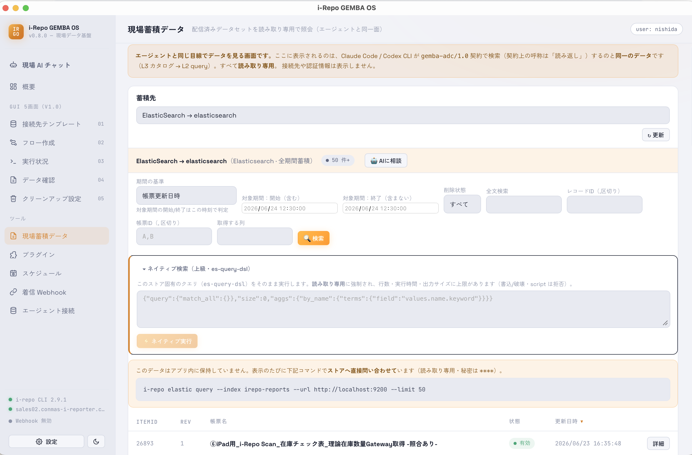

# 現場蓄積データ

送信が終わったデータを、アプリ内で**読み取り専用**で閲覧・検索する画面です。AI が読むのと同じ仕組みを、人間が画面で見られるようにしたものです。

- データセットを選ぶと一覧が表示されます。
- **詳細** ボタンで、項目（クラスター）の値・添付ファイル・元データを確認できます。
- 送り先のパスやパスワードなどの接続情報は表示しません（安全のため）。

## 実行履歴（旧・実行状況）

蓄積先カードの下に、その配信先の**実行ログ・成功確認・再実行**が常設されています。カードを押すと、その配信先に
絞った実行履歴が見られます（もう一度押す・× で全件表示に戻ります）。共有エクスポートはページ最下部にあります。

> **「成功」の見分け方**：このアプリでは、**送り先が「確かに入りました」と返した確認（レシート）が取れたときだけ
> 成功**とみなします。処理が途中で終わってもエラーにならない場合があるため、この実行履歴の成功表示で判断して
> ください。

<figure class="screenshot">
  
</figure>
