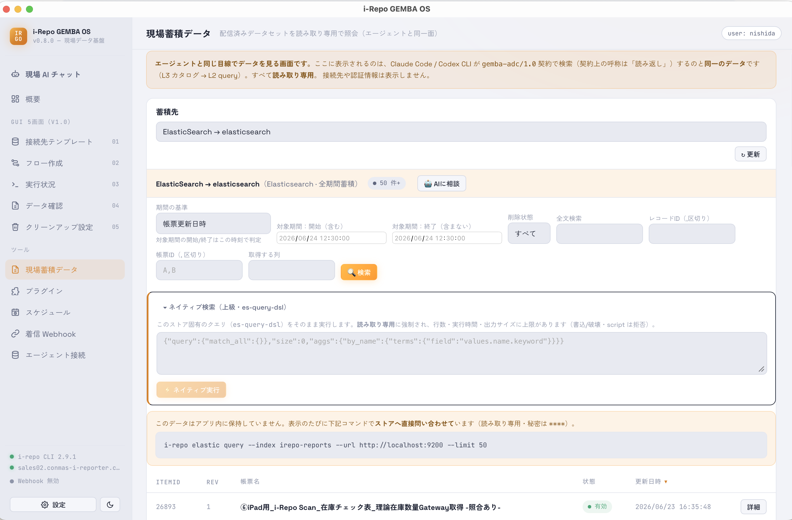

# 現場蓄積データ

送信が終わったデータを、アプリ内で**読み取り専用**で閲覧・検索する画面です。AI が読むのと同じ仕組みを、人間が画面で見られるようにしたものです。

- データセットを選ぶと一覧が表示されます。
- **詳細** ボタンで、項目（クラスター）の値・添付ファイル・元データを確認できます。
- 送り先のパスやパスワードなどの接続情報は表示しません（安全のため）。

### その場で「付箋」（意味づけ）

レコードの詳細を開くと、クラスター値の表の各行に **「付箋」ボタン** が出ることがあります
（帳票定義に紐づくフローで、詳細つきで配信されているデータセットの場合）。
実データを見て意味が分かった、その場で項目の意味・正準名・型を付けて確定できます
（Ontology Studio と同じ編集画面が開きます）。

<figure class="screenshot">
  
</figure>
