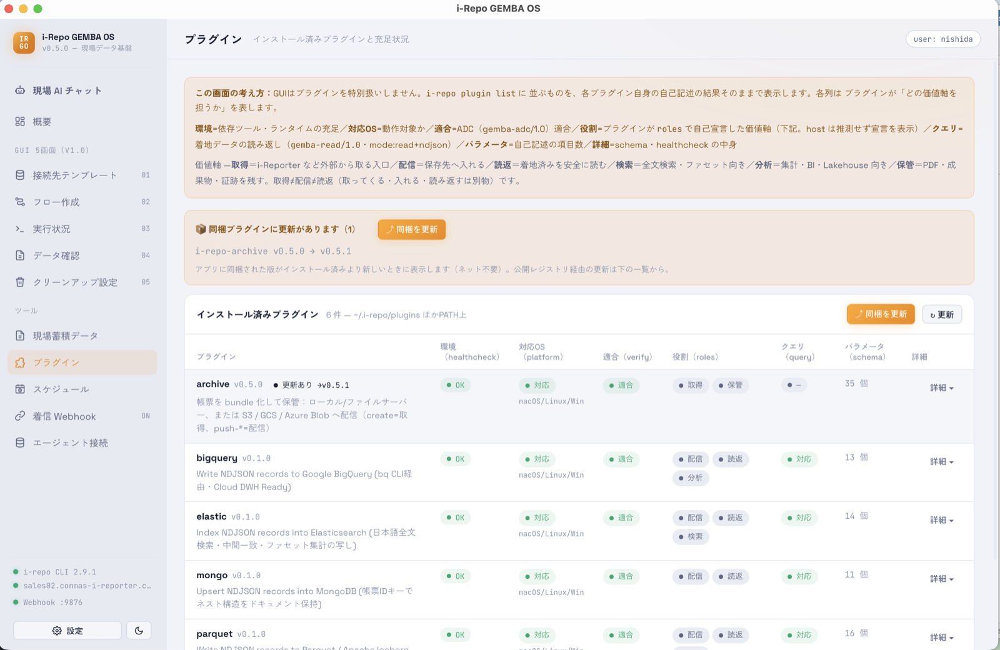

# プラグイン

インストール済みのプラグイン（送り先ごとの部品）の一覧と、**使える状態かどうか**を確認する画面です。ここからプラグインの**導入・更新**もできます。

## 導入する（ボタンひとつ）

**「📥 公式プラグインを導入」ボタン**を押すと、アプリに同梱された公式プラグインが使える場所（`~/.i-repo/plugins`）に配置されます。**ダウンロードやコマンド入力は不要**です（プラグインはアプリに同梱されているため）。初めて使うときは、まずこのボタンを押してください。

## 更新に気づく

アプリに同梱された版がインストール済みより新しいとき、画面上部に **「📦 同梱プラグインに更新があります」** と表示され、各プラグインの行にも **「更新あり」** バッジが出ます。**「⤴ 同梱を更新」ボタン**を押すと最新へ更新できます（ネット接続は不要）。

- 例：アーカイブの送り先に Google Cloud Storage / Azure Blob / ファイルサーバーが増えても、更新すれば[フロー作成](screen-flows.html)で選べるようになります。
- 公開レジストリ経由でさらに新しい版がある場合は、同じ画面の「インストール / 更新（公式レジストリ）」から取得できます。

## 一覧の見方

- **環境**：必要なツール・接続先がそろっているか。
- **対応OS / 適合 / クエリ対応**：そのプラグインで何ができるか。
- 行を開くと、**📂 フォルダを開く**（インストール先を表示）と **🗑 アンインストール**（確認のうえ削除）ができます。共有ライブラリは残すので、他のプラグインには影響しません。

<figure class="screenshot">
  
</figure>

各プラグインの詳しい使い方は[プラグイン使い方集](プラグイン使い方集/)を参照してください。
