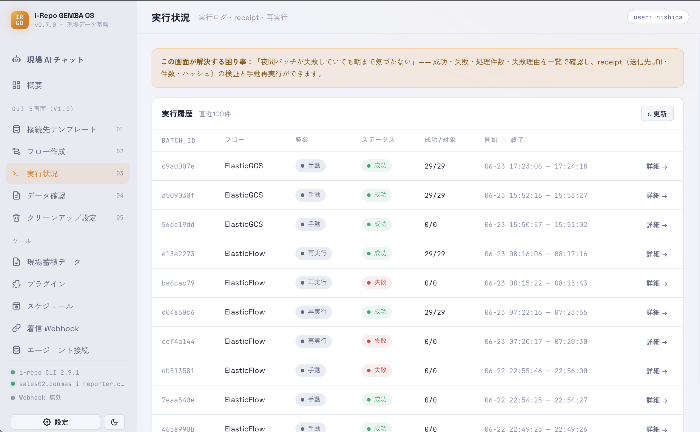

# 実行状況

配信の実行ログ・結果・再実行を行う画面です。**[現場蓄積データ](screen-gemba.html)** の中から開きます
（以前はサイドバーに独立して並んでいましたが、見る場所を 1 か所にまとめました）。

> **「成功」の見分け方**：このアプリでは、**送り先が「確かに入りました」と返した確認（レシート）が取れたときだけ成功**とみなします。処理が途中で終わってもエラーにならない場合があるため、実行状況画面の成功表示で判断してください。

### 成果物（PDF・画像など）を見る

実行の詳細を開くと、いちばん上に**その実行で配信されたファイルの一覧**が出ます。

- **🌐 ブラウザで開く** — ブラウザで表示します。クラウド（S3 / GCS / Azure）へ配信したファイルは、
  **有効期限つきの一時 URL**（15 分）で開くので、この端末にコピーを残しません。
- **⬇ 保存** — 手元に保存します。ローカルにあればそれをコピーし、無ければクラウドから直接取得します。
- 容量節約のためローカルの実体は自動で片付きますが、**クラウドへ配信済みのファイルはそのあとも開けます**。
  逆に**ここにしかコピーが無いファイルは自動では消しません**。その場合は一覧に注意の表示が出ます。

> 一時 URL はパスワードと同じ扱いです。人に転送したり貼り付けたりしないでください
> （アプリはこの URL を画面やログに出しません）。

<figure class="screenshot">
  
</figure>
