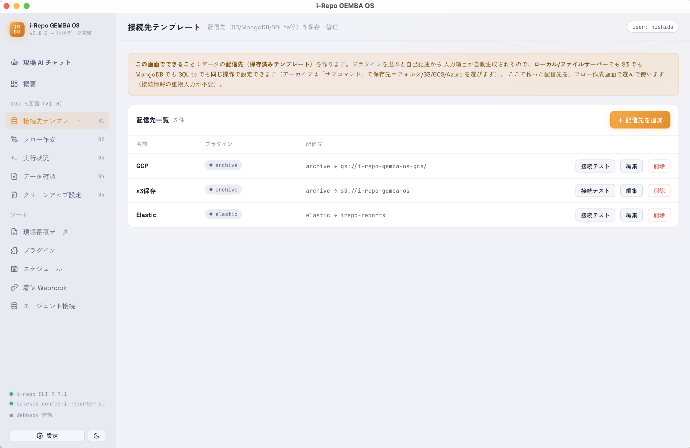
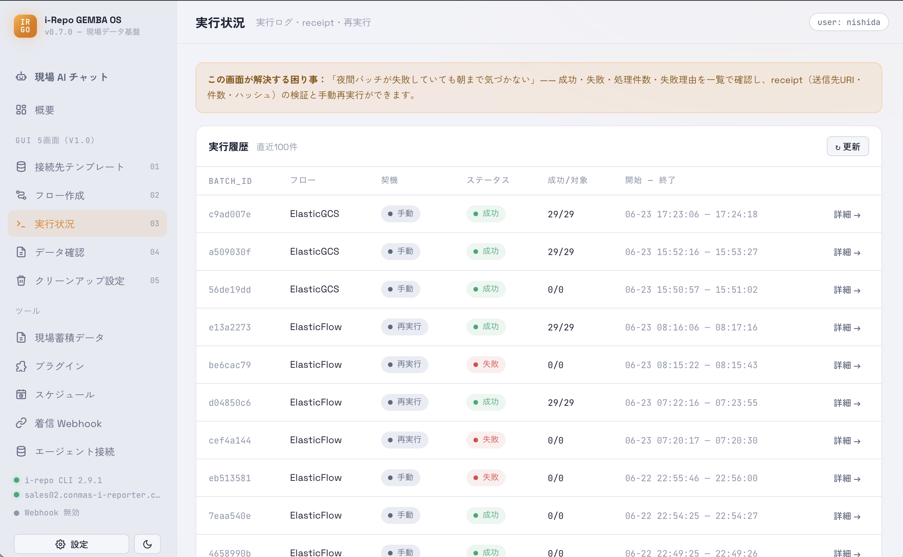
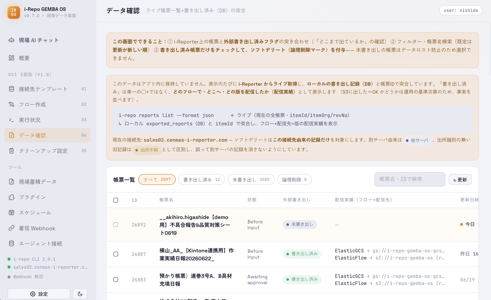
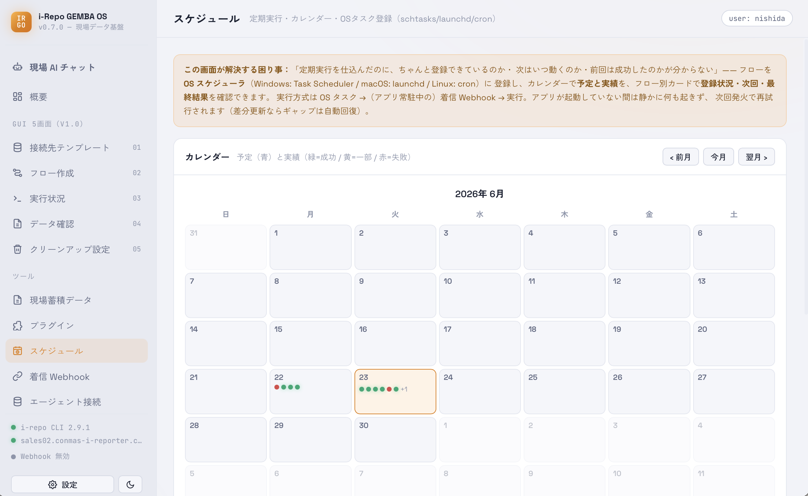
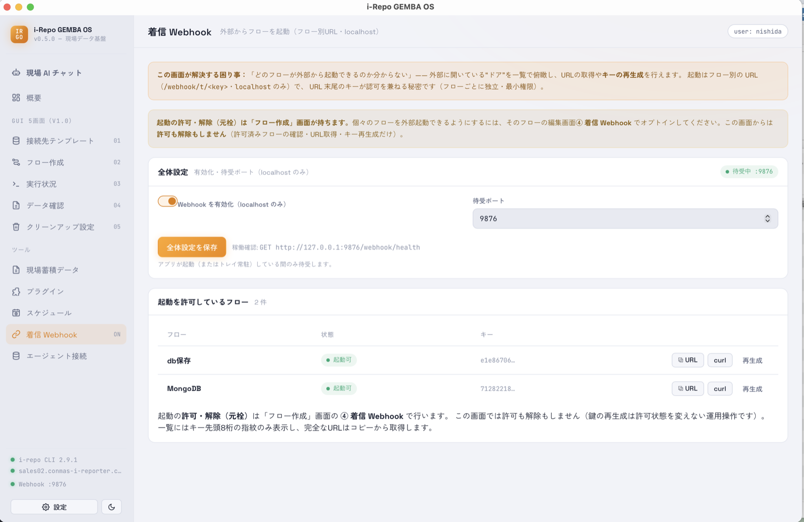
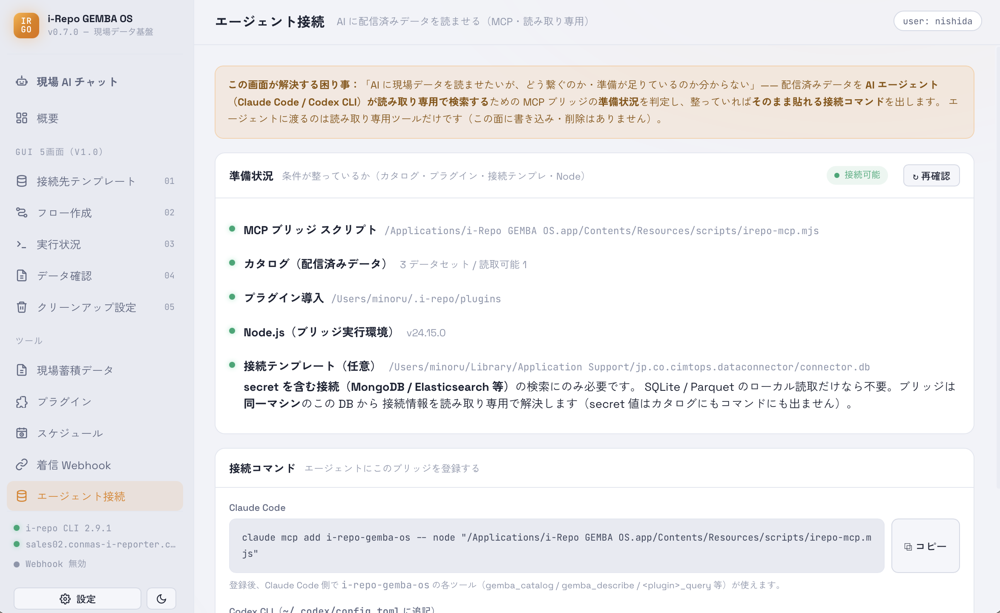

# i-Repo GEMBA OS ユーザーマニュアル
{: .no_toc }

1. TOC
{:toc}

---

## 1. このアプリでできること

**i-Repo GEMBA OS** は、i-Reporter で集めた現場の帳票データを、そのままにせず「使える形」にするためのデスクトップアプリです（Windows / macOS）。むずかしい設定やプログラミングは要りません。

できることは、大きく3つです。

| やりたいこと | このアプリでの言い方 | ざっくり言うと |
|---|---|---|
| 帳票データを社内のデータ置き場へ自動で送りたい | **配信（フロー）** | 「どの帳票を・いつ・どこへ」を決めておくと、自動で送り続けます |
| 送ったデータが本当に入ったか確認したい | **データ確認 / 現場蓄積データ** | 送信元と送信先を突き合わせ、中身もアプリ内で見られます |
| データについて人に聞くように質問したい | **現場 AI チャット** | 「先月の不具合報告を要約して」のように、AI に日本語で聞けます |

送り先（データ置き場）は、お客様の環境に合わせて選べます — **SQLite / Parquet / MongoDB / Elasticsearch / BigQuery / Amazon S3** など。

<figure class="screenshot">
  
  <figcaption>メイン画面（概要）— 全体の状況がひと目で分かります</figcaption>
</figure>

---

## 2. 初回セットアップ

1. アプリを起動します。
2. 初回は **設定** 画面が自動で開きます。
3. **i-Reporter の接続先（API エンドポイント）**・**ユーザーID**・**パスワード** を入力して保存します。
4. 同梱のプラグイン（送り先ごとの部品）をインストールします。
   - Windows: `powershell -ExecutionPolicy Bypass -File .\plugins\install.ps1`
   - macOS / Linux: `./plugins/install.sh`
5. 画面左下の状態表示で **`i-repo CLI` が緑** になっていれば準備完了です。

> プラグインは「送り先の種類」ごとの部品です。使う送り先のプラグインだけ入っていれば動きます（[3.10 プラグイン](#310-プラグイン) で状態を確認できます）。

---

## 3. 画面の使い方

サイドバーの並びは、データの流れ（**つなぐ → 作る → 動かす → 見る → 片付ける**）に沿っています。

### 3.1 概要

アプリ全体の状況をまとめて表示するダッシュボードです。直近の配信件数・成功/失敗、つながっている送り先などをひと目で確認できます。

<figure class="screenshot">
  
</figure>

### 3.2 接続先テンプレート

データの送り先（例: S3 バケット、MongoDB の接続先、SQLite ファイルの場所）に名前を付けて保存しておく画面です。一度登録すれば、フロー作成のときに選ぶだけで再利用できます。

<figure class="screenshot">
  
</figure>

### 3.3 フロー作成

「**どの帳票を・どの期間・どこへ送るか**」を1セットにまとめたものが **フロー** です。

- 対象の帳票定義・期間・送り先を選びます。
- **今すぐ実行** するほか、**③ 実行条件** で **毎日／毎週／一定間隔** の定期実行を設定できます。実際の自動実行は [スケジュール](#38-スケジュール) 画面で OS スケジューラへ登録します。
- 「**詳細も一緒に送る**」を有効にすると、帳票内の項目（クラスター）の値まで取り込め、あとで [現場蓄積データ](#37-現場蓄積データ) や [現場 AI チャット](#312-現場-ai-チャット) で細かく見られます。
- 外部システムからこのフローを起動したい場合は、ここで **着信 Webhook を許可**します（[3.9](#39-着信-webhook) 参照）。

<figure class="screenshot">
  
</figure>

<a id="version-changed"></a>

#### 「版変更」と表示されたとき

フローの一覧に **「版変更 v0.4.1→v0.4.2」** のような印が付くことがあります。これは、その
フローが使う**帳票データの取り出しプラグイン（抽出プラグイン）**が、フローを作ったときから
**バージョンアップした**ことを知らせる印です。

- **実行に支障はありません。** これまで通り配信できます（止まったり失敗したりはしません）。
- 印を消したいときは、フロー一覧のこの印の横にある **「解消」** を押してください。記録している
  バージョンが現在のものに更新され、印が消えます（配信の中身は変わりません）。**この「解消」
  ボタンが印を消す方法です**（フローを編集して保存し直すだけでは消えません）。
- プラグインのバージョンアップで取り出せる項目などが変わっている可能性が気になる場合は、
  [プラグイン](#310-プラグイン)画面でそのプラグインの状態を確認してください。

### 3.4 実行状況

配信の実行ログ・結果・再実行を行う画面です。

> **「成功」の見分け方**：このアプリでは、**送り先が「確かに入りました」と返した確認（レシート）が取れたときだけ成功**とみなします。処理が途中で終わってもエラーにならない場合があるため、実行状況画面の成功表示で判断してください。

<figure class="screenshot">
  
</figure>

### 3.5 データ確認

i-Reporter 側の「今ある帳票一覧」と、アプリが「送信済みとして記録しているもの」を**突き合わせて**表示します。「送ったはず／まだ送っていない」を取り違えないための画面です。

<figure class="screenshot">
  
</figure>

<a id="unknown-provenance"></a>

#### 「出所不明」と「紐付け」

データ確認の一覧で、ある帳票に **「出所不明 3」** のような印が付くことがあります。これは、
**送り先（接続先）の記録が残っていない古い配信実績**が、その件数だけあるという意味です
（以前のバージョンで記録された、または接続先を切り替える前の記録など）。

- それらが**いまの接続先に送ったもの**だと分かっている場合は、行の右にある **「紐付け」** を
  押すと、今の接続先の記録として確定できます。確定すると「書き出し済み」として扱われ、
  クリーンアップ（整理）の対象にもできます。
- 心当たりがない場合は、無理に紐付けず**そのままで構いません**（誤って別サーバの記録を
  取り込まないための安全策です）。
- よく似た「**他サーバ**」（別の接続先で書き出された記録）や「**別帳票疑い**」は、この画面
  からは触れません。取り違え防止のため対象外にしています。

### 3.6 クリーンアップ設定

送信元のデータを整理する設定です。**保持期間**・**承認フロー**・**ソフトデリート**（すぐ消さず「削除予定」にして後で戻せる方式）を決められます。

> 元データの削除に関わる設定です。**送信先に確実に入ったことを確認してから**整理するのが安全なので、データ確認の後ろに置いています。

<figure class="screenshot">
  
</figure>

### 3.7 現場蓄積データ

送信が終わったデータを、アプリ内で**読み取り専用**で閲覧・検索する画面です。AI が読むのと同じ仕組みを、人間が画面で見られるようにしたものです。

- データセットを選ぶと一覧が表示されます。
- **詳細** ボタンで、項目（クラスター）の値・添付ファイル・元データを確認できます。
- 送り先のパスやパスワードなどの接続情報は表示しません（安全のため）。

<figure class="screenshot">
  
</figure>

### 3.8 スケジュール

フローを**定期的に自動実行**するための画面です。実行は OS の標準スケジューラ（Windows: タスク スケジューラ / macOS: launchd / Linux: cron）に登録するため、アプリを最小化していても決まった時刻・間隔で動きます。

- **頻度の決め方**：フローの設定は「フロー作成」画面の **③ 実行条件** で行います（**毎日／毎週（曜日指定）／一定間隔**）。
- **OS への登録**：この画面のフロー別カードで **登録** を押すと OS スケジューラに登録されます（保存だけでは登録されません）。**解除**・**再登録**・**今すぐ実行** もここから行えます。
- **カレンダー**：その月の **予定（青）** と **実績（緑＝成功／黄＝一部／赤＝失敗）** をひと目で確認できます。
- **発火の前提**：定期実行は[着信 Webhook](#39-着信-webhook)経由で動くため、対象フローの着信 Webhook を有効にしておく必要があります。妨げる要因があるときは、カードに警告（**未オプトイン**など）が出ます。
- **取りこぼしの自動回復**：期間を **差分** にしておくと、アプリ停止などで発火できなかった分も、次回成功時にまとめて取り込めます（取得量も最小になります）。

<figure class="screenshot">
  
</figure>

### 3.9 着信 Webhook

他のシステムから、HTTP で**このアプリの特定フローを起動**できる入口です（同じPC内＝localhost 限定）。詳しい設定は [5. 着信 Webhook の詳細](#5-着信-webhook-の詳細) を参照してください。

<figure class="screenshot">
  
</figure>

### 3.10 プラグイン

インストール済みのプラグイン（送り先ごとの部品）の一覧と、**使える状態かどうか**を確認する画面です。

- **環境**：必要なツール・接続先がそろっているか。
- **対応OS / 適合 / クエリ対応**：そのプラグインで何ができるか。
- 行を開くと、**📂 フォルダを開く**（インストール先を表示）と **🗑 アンインストール**（確認のうえ削除）ができます。共有ライブラリは残すので、他のプラグインには影響しません。

<figure class="screenshot">
  
</figure>

<a id="agent-connect"></a>

### 3.11 エージェント接続（Claude Code / Codex CLI）

お手元の AI エージェント（**Claude Code** または **Codex CLI**）に、送信済みの現場データを
**読み取り専用で**読ませるための画面です。設定すると、ターミナルの AI から
「先月の指摘が多かった項目は？」のように、現場データを使って質問に答えられるようになります
（AI が見るのは送信済みデータの索引だけ。書き換え・削除はできません）。料金は各 AI のご自身の
アカウント側に発生します（このアプリは課金しません）。

<figure class="screenshot">
  
</figure>

#### つなぎ方（3ステップ）

**① AI エージェントを用意する**（どちらか一方）

```bash
# Claude Code（Anthropic）
npm install -g @anthropic-ai/claude-code

# Codex CLI（OpenAI）
npm install -g @openai/codex
```

> インストールの最新手順は各公式サイトを参照してください。すでに入っている場合はこの手順は不要です。

**② この「エージェント接続」画面を開く**

お使いの環境に合わせた**接続コマンド／設定がそのまま表示**されます（必要なパスは自動で埋まります）。

**③ 使うエージェントに登録する**（画面の「コピー」ボタンを使うと確実）

- **Claude Code**: 「Claude Code」欄の **コピー** を押し、表示されたコマンドをターミナルで実行します。
  ```bash
  claude mcp add i-repo-gemba-os -- node <画面に表示されるパス>/irepo-mcp.mjs
  ```
- **Codex CLI**: 「Codex CLI」欄の **コピー** を押し、`~/.codex/config.toml` に貼り付けます。
  ```toml
  [mcp_servers.i-repo-gemba-os]
  command = "node"
  args = ["<画面に表示されるパス>/irepo-mcp.mjs"]
  ```

登録後、エージェント側で **`i-repo-gemba-os`** のツール（`gemba_catalog` / `gemba_describe` /
`<プラグイン>_query` など）が使えるようになります。あとは AI に現場データについて聞くだけです。

> アプリの中だけで完結させたいなら、エージェントの用意は不要です → [3.12 現場 AI チャット](#312-現場-ai-チャット)。

### 3.12 現場 AI チャット

アプリの中で、**現場データについて AI に日本語で質問**できる画面です。お使いの Claude をそのまま使うため、推論の料金はお客様のアカウント側に発生します（このアプリが勝手に課金することはありません）。

- 「先月の点検で指摘が多かった項目は？」のように、自然な言葉で聞けます。
- AI は[現場蓄積データ](#37-現場蓄積データ)を**読み取り専用**で参照します。データを書き換えたり消したりはしません。

<figure class="screenshot">
  
</figure>

---

## 4. 常駐（システムトレイ）

- ウィンドウの **×** を押してもアプリは終了せず、**トレイに最小化**されます。
- トレイアイコンから **ウィンドウを表示** / **終了** を選べます。
- [スケジュール](#38-スケジュール)（OS スケジューラ）や着信 Webhook による実行は、アプリが起動（またはトレイ常駐）している間に受け付けます。閉じている間に来た発火は実行されませんが、次回以降は再び動き、差分設定なら取りこぼしを自動回復します。

---

## 5. 着信 Webhook の詳細

外部システムから HTTP でフローを起動できます（localhost のみ）。フローごとに発行される**専用 URL**そのものが鍵（許可証）を兼ねます。フローごとに独立して発行・失効でき、最小限の権限で運用できます。

### 設定（2ステップ）

1. **全体を有効化**：サイドバーの **着信 Webhook** 画面で有効にし、ポート（既定 9876）を設定します。
2. **フローごとに許可**：**フロー作成** 画面で対象フローを開き、**着信 Webhook を許可**して保存します。そのフロー専用の起動 URL が発行されます。

> **許可の「元栓」はフロー作成画面です。** 外部から起動できるようにする／やめるは、そのフローの編集画面で行います。**着信 Webhook** 画面は、許可済みフローの一覧・URL の取得・鍵の再発行（運用）専用で、ここから新たに許可を付けることはできません。

### エンドポイント

```
GET  http://127.0.0.1:9876/webhook/health     # 稼働確認（認証不要）
POST http://127.0.0.1:9876/webhook/t/<key>    # フロー専用の起動 URL
```

### 鍵の扱い

URL に含まれる `<key>` 自体が秘密で、識別と許可を兼ねます（追加のヘッダやトークンは不要）。**URL そのものを秘密として扱い**、起動させたい外部システムへの登録以外では共有しないでください。フロー編集画面の「鍵を再発行」で、古い URL を失効させられます。

### レスポンス例

```json
{"ok":true,"batchId":"xxxxxxxx-xxxx-xxxx-xxxx-xxxxxxxxxxxx","trigger":"webhook"}
```

HTTP 202（受付＝非同期）を返します。進捗は実行状況画面で確認してください。未知の鍵・未許可フローは `404`、全体が無効なときは `503` を返します。

### curl 例

```bash
curl -X POST http://127.0.0.1:9876/webhook/t/YOUR_FLOW_KEY
```

---

## 6. AI 連携の詳細

配信が成功するたびに、AI が読むための索引（カタログ）が `~/.i-repo/catalog/` に書き出されます。

- **アプリの中で質問する**なら → [3.12 現場 AI チャット](#312-現場-ai-チャット)
- **手元の Claude Code / Codex CLI から読ませる**なら → [3.11 エージェント接続](#agent-connect)（接続コマンドは画面が表示します）

いずれの場合も AI からの操作は**読み取り専用**で、書き込み・削除はできません。詳しい契約は [AGENTS.md](../AGENTS.md) と [エージェント・データアクセス仕様 v1.0](仕様/エージェント・データアクセス仕様_v1.md) を参照してください（開発者・上級者向け）。

---

## 7. トラブルシューティング

| 症状 | 確認すること |
|---|---|
| プラグインが見つからない | `install.ps1`（Windows）/ `install.sh`（macOS・Linux）を実行したか |
| 現場蓄積データに何も出ない | フローを1回成功させたか（実行状況で成功表示を確認） |
| 詳細に項目（クラスター）が出ない | フローで「詳細も一緒に送る」を有効にして送り直したか |
| 着信 Webhook が 404 | フローで「着信 Webhook を許可」したか・URL の鍵が最新か（再発行で古い URL は失効） |
| 着信 Webhook が 503 | 着信 Webhook 画面で全体が有効か・ポート番号を確認 |
| 毎日の自動実行が動かない | アプリが起動（またはトレイ常駐）しているか |
| AI エージェントがデータを読めない | [エージェント接続](#agent-connect)画面のコマンド／設定を登録したか・Claude Code / Codex CLI を入れたか・一度フローを成功させたか |

---

## 8. 用語集

製品の表示や本マニュアルに出てくる言葉の補足です（読み飛ばして構いません）。

- **フロー**：「どの帳票を・いつ・どこへ送るか」をまとめた配信の設定。
- **プラグイン**：送り先の種類ごとの部品（SQLite 用・S3 用 など）。
- **レシート**：送り先が「確かに入った」と返す確認データ。これが取れて初めて成功扱い。
- **カタログ**：送信済みデータの索引（`~/.i-repo/catalog/`）。AI が最初に読む入口。
- **クエリ（読み返し）**：送信済みデータを安全に読み出すための仕組み（読み取り専用）。
- **MCP**：AI ツールにデータを読ませるための標準的な接続方式。
- **クラスター**：i-Reporter の帳票内で項目をまとめた単位。「詳細も一緒に送る」で取り込めます。
