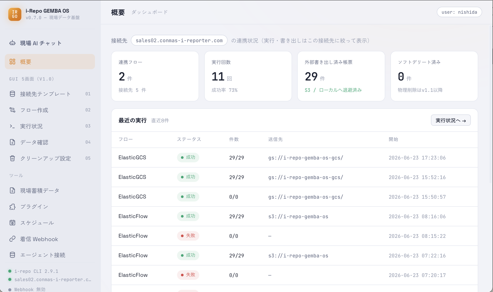

# i-Repo GEMBA OS ユーザーマニュアル

**i-Repo GEMBA OS** は、i-Reporter で集めた現場の帳票データを、そのままにせず「使える形」にするためのデスクトップアプリです（Windows / macOS）。むずかしい設定やプログラミングは要りません。

できることは、大きく3つです。

| やりたいこと | このアプリでの言い方 | ざっくり言うと |
|---|---|---|
| 帳票データを社内のデータ置き場へ自動で送りたい | **配信（フロー）** | 「どの帳票を・いつ・どこへ」を決めておくと、自動で送り続けます |
| 送ったデータが本当に入ったか確認したい | **データ確認 / 現場蓄積データ** | 送信元と送信先を突き合わせ、中身もアプリ内で見られます |
| データについて人に聞くように質問したい | **現場 AI チャット** | 「先月の不具合報告を要約して」のように、AI に日本語で聞けます |

送り先（データ置き場）は、お客様の環境に合わせて選べます — **SQLite / Parquet / MongoDB / Elasticsearch / BigQuery / Amazon S3** など。

<figure class="screenshot">
  
  <figcaption>メイン画面（概要）— 全体の状況がひと目で分かります</figcaption>
</figure>

## このマニュアルの構成

左のメニュー（このページの下にぶら下がる項目）から、知りたいところへ進めます。

1. [初回セットアップ](manual-setup.html) — 接続設定と、送り先プラグインの準備
2. [アプリの更新（バージョンアップ）](manual-update.html) — 新しい版への入れ替え方
3. [画面の使い方](manual-screens.html) — 各画面の操作（概要・フロー作成・データ確認・スケジュール・現場 AI チャット など全12画面）
4. [常駐（システムトレイ）](manual-tray.html) — 閉じても裏で動かす
5. [着信 Webhook の詳細](manual-webhook.html) — 外部システムからフローを起動する
6. [AI 連携の詳細](manual-ai.html) — Claude / Codex などのエージェント連携
7. [トラブルシューティング](manual-troubleshooting.html) — 困ったときに
8. [用語集](manual-glossary.html) — 用語の補足

> はじめての方は **初回セットアップ → 画面の使い方（フロー作成）** の順がおすすめです。
